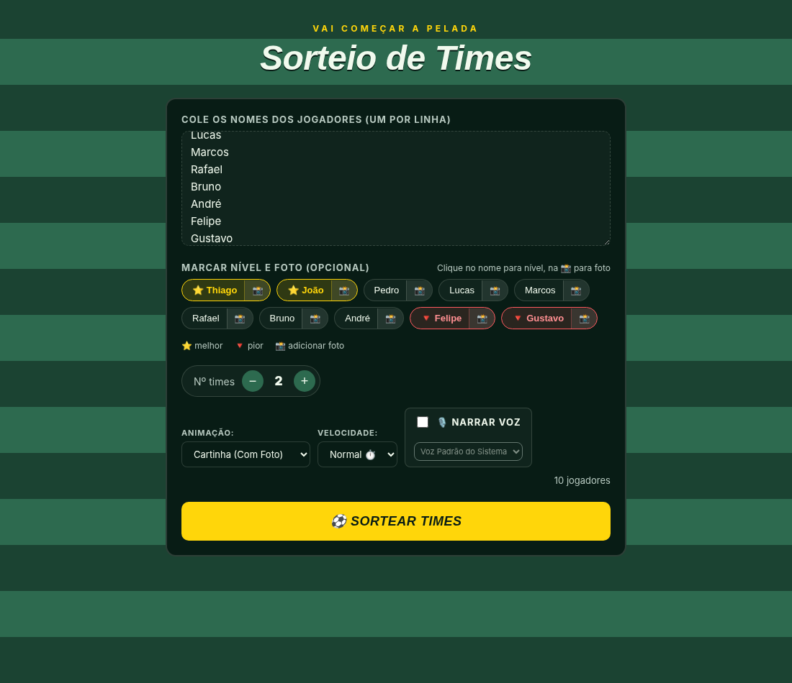
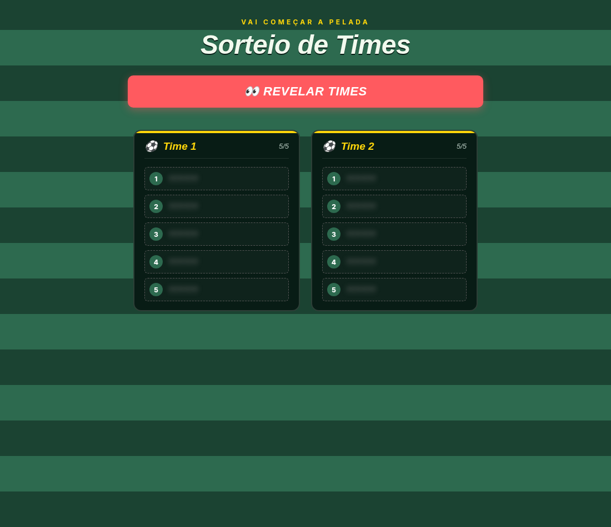
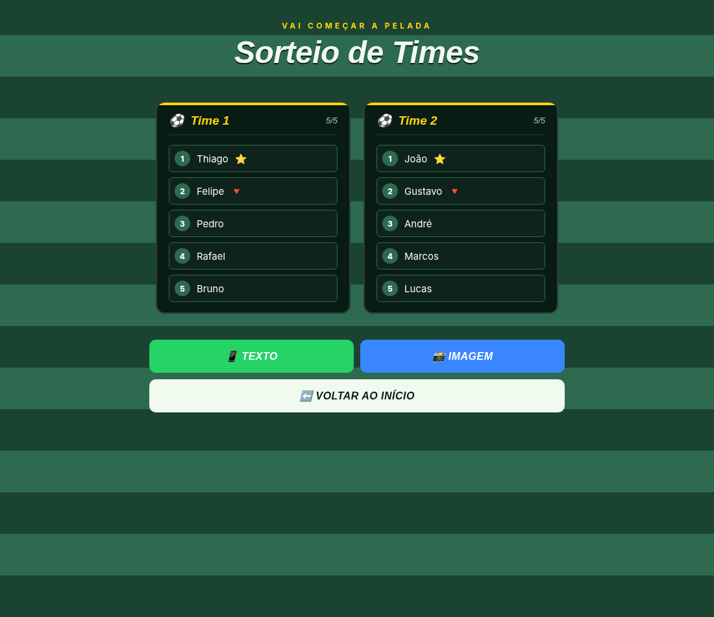

<div align="center">

# ⚽ Sorteio de Times — Pelada

Um sorteador de times para peladas, feito para montar equipes de forma rápida, visual e divertida.

**Sem cadastro, sem instalação e sem backend.** É só abrir no navegador, adicionar os jogadores e sortear.

</div>

## 📸 Preview

<p align="center">
  
</p>

### 👀 Modo às cegas

<p align="center">
  
</p>

### 🏆 Resultado final

<p align="center">
  
</p>

## ✨ Recursos

- 👥 Adicione os jogadores, um nome por linha
- ⚖️ Marque jogadores como **⭐ melhor** ou **🔻 pior** para ajudar no equilíbrio
- 📸 Adicione uma foto opcional para cada jogador
- 🔢 Escolha quantos times serão formados
- 🎴 Sorteio com animação de cartinhas
- 🎰 Roleta clássica
- 👀 Modo às cegas para aumentar o suspense
- ⚡ Escolha a velocidade da animação
- 🎙️ Narração por voz usando o navegador
- 📱 Copie os times em texto para compartilhar
- 🖼️ Gere uma imagem com o resultado
- 📐 Layout responsivo para computador e celular

## 🎮 Como usar

1. Digite ou cole os nomes dos jogadores.
2. Clique no nome de um jogador para alternar entre **⭐ melhor**, **🔻 pior** e sem marcação.
3. Se quiser, clique em **📸** para adicionar uma foto.
4. Escolha a quantidade de times.
5. Escolha o tipo de animação e a velocidade.
6. Ative ou desative a narração.
7. Clique em **⚽ Sortear times**.
8. No final, copie o resultado ou gere uma imagem para compartilhar.

## 🚀 Rodando o projeto

O projeto é totalmente estático. Não é necessário instalar Node.js, Python ou qualquer dependência.

Basta abrir o arquivo:

```text
index.html
```

em um navegador moderno.

## 🌐 Publicando no GitHub Pages

1. Envie os arquivos para um repositório no GitHub.
2. Abra **Settings → Pages**.
3. Em **Build and deployment**, escolha **Deploy from a branch**.
4. Selecione a branch `main`.
5. Selecione a pasta `/ (root)`.
6. Clique em **Save**.

## 🗂️ Estrutura

```text
sorteio-times/
├── index.html
├── README.md
├── 01-configuracao.png
├── 02-modo-cego.png
└── 03-resultado.png
```

## 🛠️ Tecnologias

- HTML5
- CSS3
- JavaScript
- Web Speech API
- html2canvas

## 🎯 Objetivo

A ideia é facilitar a organização de peladas sem precisar instalar aplicativo, criar conta ou configurar servidor.

Abra a página, coloque os jogadores e faça o sorteio.

---

<div align="center">

### ⚽ Bora montar os times?

Feito para deixar a organização da pelada mais rápida e divertida.

</div>
